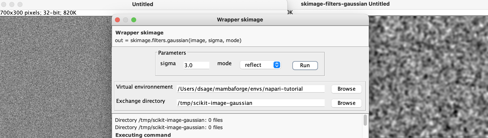

# Wrapper scikit-image for FIJI

*written by Daniel Sage, EPFL. 23 October 2023*

These Java wrappers allow to call Python scripts from a ImageJ plugin. The images are exchange by files.

## Current wrappers
#### Gaussian filter
>out = skimage.filters.gaussian(image, sigma, mode)

[scikit-image gaussian](https://scikit-image.org/docs/stable/api/skimage.filters.html#skimage.filters.gaussian)

#### Segmentation by snake (active_contour)
>out = skimage.segmentation.active_contour(image, init, w_line, w_edge)

[scikit-image active_contour](https://scikit-image.org/docs/stable/auto_examples/edges/plot_active_contours.html)

## Installation

The wrapper require the installation of conda (e.g. miniconda) to access to the Python library *scikit-image* in a safe environment.

>conda create -n scikit-image-env

>conda scikit-image-env

>pip install scikit-image

## Setup

- Select the virtual environment: /path/.../scikit-image-env/
- Select a temporary directory to exchange documents

